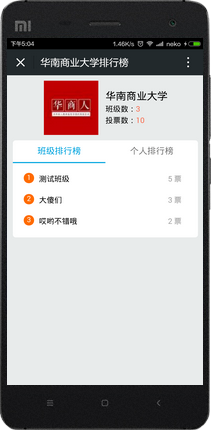
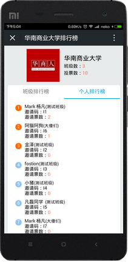
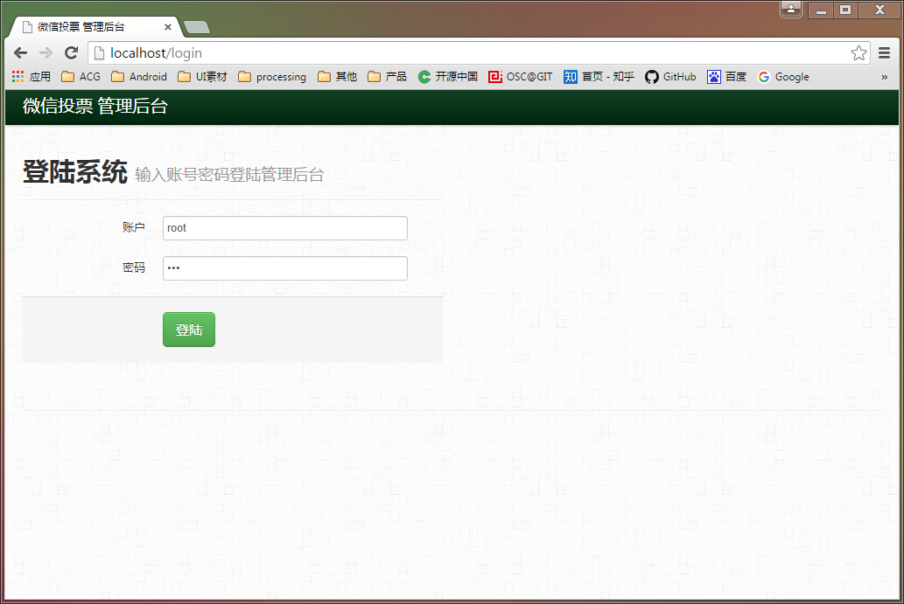
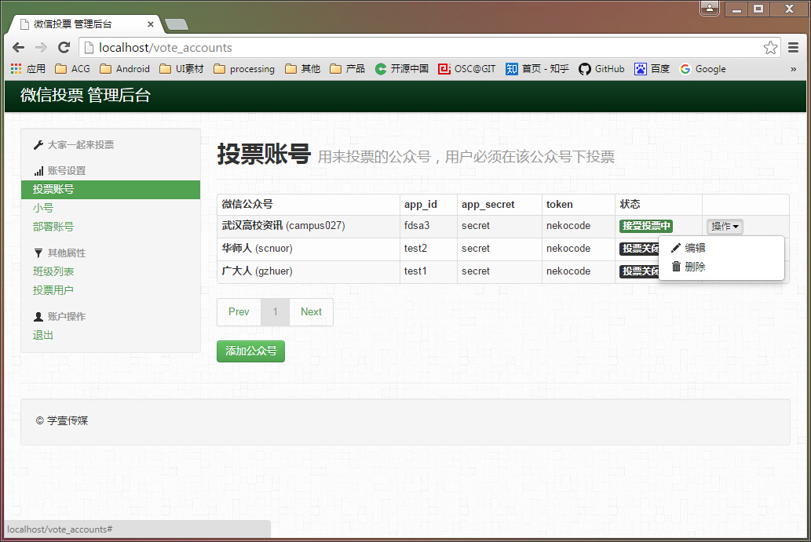

# weixin_vote

### run steps
- add config.py
```
DOMAIN = ''
DB_HOST = ''
DB_NAME = ''
DB_USER = ''
DB_PWD = ''
```
- run `index.py`

### feature
- tornado
- torndb(no ORM!): http://torndb.readthedocs.org/en/latest/#
- multiple accounts suport

### libs
- tornado
- MySQL-python
- pycrypto
- httplib2
- bs4
- requests

### todo
- [ ] 把 access_token 存入数据库（考虑去掉 WeixinRefreshATKWorker）
- [x] 把 active 属性迁移到子账号上
- [x] 自动获取公众号基本信息
- [ ] 邀请码、注册码自动定时清理
- [x] 管理后台
- [x] 将 WeixinRefreshATKWorker 分离出来

### screenshots






## admin


